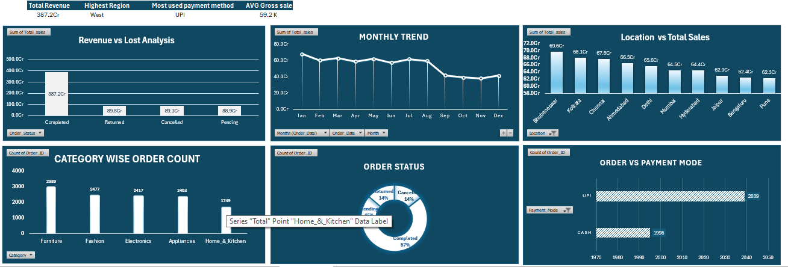

# 📊 Data Analyst Minor Projects

This repository contains 2 Minor Projects built using SQL & Excel for my Data Analyst Portfolio.

---

# 📁 Project 1 : Sales Data Analysis

### 📌 Problem Statement
Analyzed sales data to find monthly revenue, top products, and sales trends for business decision making.

**Files:**
- `Project_1_Clean_sales_data.csv` - Cleaned sales dataset
- `Project_1_Sale_queries.sql` - SQL analysis (Total Orders, Revenue, Avg Sales)
- `Project_1_sales_data_analysis.xlsx` - Excel Dashboard with Pivots & Charts

**What I Did:**
- Cleaned raw sales data (duplicates, nulls, formats)
- Wrote SQL queries for Total Revenue, Category-wise Sales, Monthly Trends
- Built Excel dashboard

**Dashboard Preview:**

**SQL Queries :**
-  overall business performances
- select
- count(*) as Total_orders,
- (sum(total_sales)/10000000) as Total_revenue_Cr,
- round(avg(total_sales)/1000,2) as Avg_order_value_Thousand,
- sum(quantity) as Total_units
- from sales;
-
-   

-   revenue by category and product - what sells most?
-  select category, product, sum(quantity) as units_sold, round(sum(total_sales)/10000000,2) as Revenue_Cr
-  from sales
-  where order_status = 'completed'
-  group by category, product
-  order by Revenue_Cr desc limit 10;
-
-    

**Tools:** `Excel` `MySQL` 

---

# 📁 Project 2 : Employee Data Analysis
### 📌 Project 2: Employee Data Analysis - Problem Statement

**Business Problem:** The HR database (Srijan emp data) contains raw, uncleaned data with no insights on workforce diversity and salary.

**Task:** To clean the data and answer key HR questions using SQL.

**Files:**
- `Project_2_Srijan_emp_data.csv` - Raw employee dataset
- `Project_2_Data_cleaning_emp_data...` - Cleaned employee data 
- `Project_2_Emp_queries.sql` - SQL queries for HR insights

**What I Did:**
- Cleaned employee data using python
- Wrote SQL queries for:
    - Total number of employees
    - Gender-wise count (Male/Female)
    - Female employees records & salary filter (>=40000)
- HR & Workforce Analysis

**SQL Queries :**
-  Department wise employee count
- select department, count(*) as total_employees from srijan_emp group by department order by total_employees desc;
   

-  Average Salary by Department:
- select department, round(avg(exact_salary),0) as avg_salary from srijan_emp group by department order by avg_salary desc;
    

-  Top 5 highest paid employee
- select employee_name, designation, monthly_salary from srijan_emp order by monthly_salary desc limit 5;s;
    

**Tools:** `Excel` `MySQL` `Python`

---

### 🛠️ Tech Stack
`SQL` `Excel` `MySQL` `Data Analysis`

### 👨‍💻 About Me
Aspiring Data Analyst | Major Project: Kolkata House Price Prediction (1 Lakh+ rows) | 2 Minor Projects

### 🔗 Portfolio
- Major Project: [Kolkata House Price](https://github.com/SumitkumarRoy007)
- Minor Projects: This Repo
